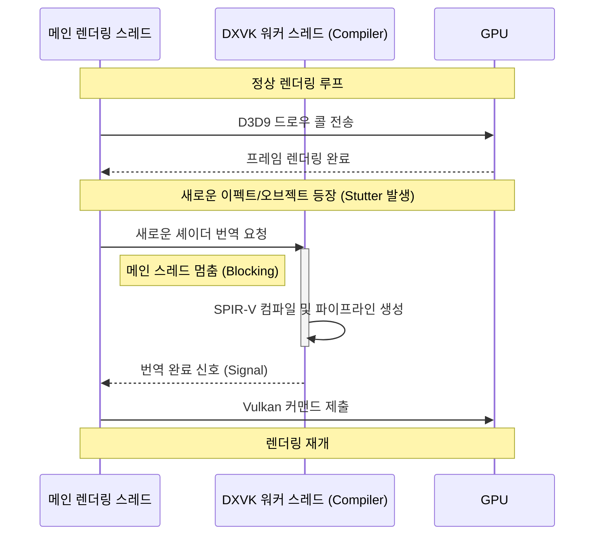

> **요약 (Abstract)**
> 이전 벤치마크 테스트에서 마비노기에 DXVK를 적용할 경우 평균 프레임(Avg FPS)은 크게 상승하나, 1% Low 프레임이 급격히 하락하며 마이크로 스터터링(Micro-stuttering)이 발생하는 현상을 관측했습니다. 본 포스팅에서는 Windows Performance Analyzer (WPA)를 활용하여, 이 현상의 근본 원인이 **DXVK 워커 스레드의 점유율 폭주로 인한 메인 렌더링 스레드 블로킹(Thread Blocking)**에 있음을 커널 수준에서 증명합니다.

---

## 1. 문제 제기: 왜 1% Low만 박살 나는가?

이전 글에서 제시했던 가설 중 가장 유력한 용의자는 **'셰이더 컴파일 지연'**이었습니다. 새로운 파이프라인 컴파일이 메인 스레드에 블로킹을 유발하는지 확인하기 위해, 순정 D3D9 환경과 DXVK 환경의 시스템 스케줄링 데이터를 대조(A/B Test)했습니다.

## 2. 거시적 관점: 기하급수적으로 증가한 OS 동기화 비용

운영체제 커널 레벨에서 발생하는 이벤트의 밀도를 먼저 비교해 보았습니다.

위 WPA 타임라인을 보면 DXVK 환경은 타임라인 전체가 `SignalSynchronization`, `WorkerThread` 등의 이벤트 블록으로 빽빽하게 들어차 있습니다. 이는 D3D9 명령을 Vulkan으로 번역하는 과정에서 스레드 간 동기화 오버헤드가 순정 상태보다 압도적으로 높음을 시사합니다.

## 3. 미시적 관점: 스모킹 건(Smoking Gun) - 메인 스레드의 추락

가장 결정적인 증거는 CPU Usage 타임라인에서 발견되었습니다. 스터터링이 발생한 21초~23초 구간을 줌인해 보았습니다.

분석 결과는 명확했습니다. 메인 스레드(하늘색)가 렌더링을 멈추고 **대기(Wait) 상태**로 추락한 정확히 그 순간, **DXVK 워커 스레드(빨간색 점선)**가 CPU를 맹렬하게 점유하며 치솟습니다.

이 현상을 Mermaid 시퀀스 다이어그램으로 도식화하면 다음과 같습니다.

## 4. 범인의 정체 확인: d3d9.dll (DXVK Wrapper)

해당 워커 스레드가 실제로 무슨 일을 했는지 콜 스택(Call Stack)을 추적했습니다.

작업을 주도한 모듈은 순정 드라이버가 아닌 **`d3d9.dll`**이었습니다. 마비노기 클라이언트를 속이기 위해 위장된 **DXVK Wrapper**가 실시간 번역 부하를 일으켜 메인 스레드의 발목을 잡았음이 커널 로그로 최종 확인되었습니다.

## 5. 결론: 추측에서 사실로

이번 분석을 통해 마비노기 DXVK의 1% Low 하락은 단순한 성능 부족이 아니라, **실시간 셰이더 컴파일로 인한 구조적 블로킹**임이 입증되었습니다. 결론적으로, DXVK는 현재 **마비노기 클라이언트의 아키텍처와 호환성 문제**로 인해 최적화되지 않은 상태입니다. 제 하드웨어(i5-14500HX + RTX 4060 Laptop)에 국한된 문제일 수도 있지만, 프로파일링을 통한 결과는 DXVK가 역효과를 낼 수도 있음을 시사합니다. 감사합니다.